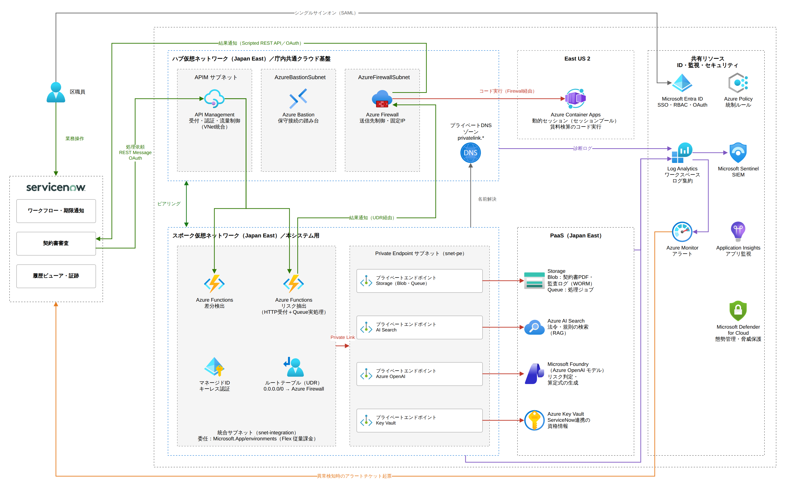

# 土地貸付契約リスク統制システム

自治体の土地貸付契約を対象に、AIによる審査と更新期限の管理を行うシステムです。**ServiceNow** と **Azure** で構築しています。

AWSが国土交通省向けに開発したAI書類審査ソリューション **RAPID** を参考に、Azureと、GRC（ガバナンス・リスク・コンプライアンス）を意識した業務フローに合わせて設計し直しました。

**[スライドとデモ動画](https://kabigon-89.github.io/landlease-risk-control/)**

> このリポジトリに含まれる契約・組織・データは、すべて架空のものです。

---

## できること

| 機能 | 仕組み |
|---|---|
| **リスク抽出** | 契約書PDFを条文ごとに分割し、リスク（必要な条項の欠落、曖昧な文言、規則との矛盾など）を指摘する。すべての指摘に原文の引用を付ける |
| **規則の参照（RAG）** | 契約書が引用している規則の原文を、Azure AI Searchから取得する |
| **賃料の検算** | AIは算定式を組み立てるだけで、計算は隔離されたPython実行環境で行う（AIには計算させない） |
| **差分の検出** | 前回の契約バージョンとの差分を、文字単位で機械的に検出する（AIは使わない） |
| **更新の管理** | 毎日動くジョブが、期限前に更新確認のチケットを作る。所管課はワークフロー上で回答し、案文を承認する |

## 構成

## 設計のポイント

- **非同期処理** – HTTPで受け付けた関数はジョブをキューに入れるだけで、実際の処理はキューで起動する別の関数が行う。ServiceNowが長い処理を待たずに済む。
- **AI呼び出しの並列化** – 条文ごとのチェックを同時に実行（`ThreadPoolExecutor`、最大4並列）し、処理時間を約6分から約50秒に短縮。
- **出力形式の制約** – Structured Outputs（JSON Schema、strictモード）を使い、チェック観点の番号（`check_id`）を判定の種類ごとに `enum` で制限。
- **プロンプトインジェクション対策** – 指示はシステムメッセージに、契約書本文と職員の補足はユーザーメッセージに分け、参考情報としてだけ扱わせる。
- **根拠の確保** – すべての指摘に原文の引用を必須にする。引用された規則は記憶に頼らず、原文を取得して照合する。
- **AIに計算させない** – AIは算定式を書くだけで、実行はマネージドIDで認証した隔離環境（Azure Container Apps のセッション）で行う。
- **観点ごとに見逃し防止と過検知防止を使い分け** – 条項の欠落は見逃し防止を優先し、「その他」の観点は61点以上の指摘だけを残す。
- **差分は機械的に検出** – バージョン比較は `difflib` を使うので、確認者は何が変わったかを正確に把握できる。

## 使用技術

| 層 | 技術 |
|---|---|
| ワークフロー・画面 | ServiceNow（スコープアプリ、Service Portal ウィジェット、Script Include、Scripted REST API、Scheduled Job） |
| 処理 | Azure Functions（Python 3.12、Flex 従量課金） |
| AI | Azure OpenAI（`gpt-5.6-terra`、`text-embedding-3-large`） |
| 検索 | Azure AI Search |
| コード実行 | Azure Container Apps 動的セッション |
| ストレージ | Azure Blob Storage、Azure Queue Storage |
| 認証 | OAuth 2.0（ServiceNow）、マネージドID（Azure） |

## 本番運用に向けて

このリポジトリは概念実証（PoC）です。本番運用では、ハブ＆スポーク構成の仮想ネットワーク、Private Endpoint、API Management、Azure Firewall、Key Vault、Microsoft Entra ID によるシングルサインオン、監視の集約（Log Analytics、Microsoft Sentinel、Defender for Cloud）を追加する設計です。目標の構成、統制の設計、コスト試算はスライドを参照してください。